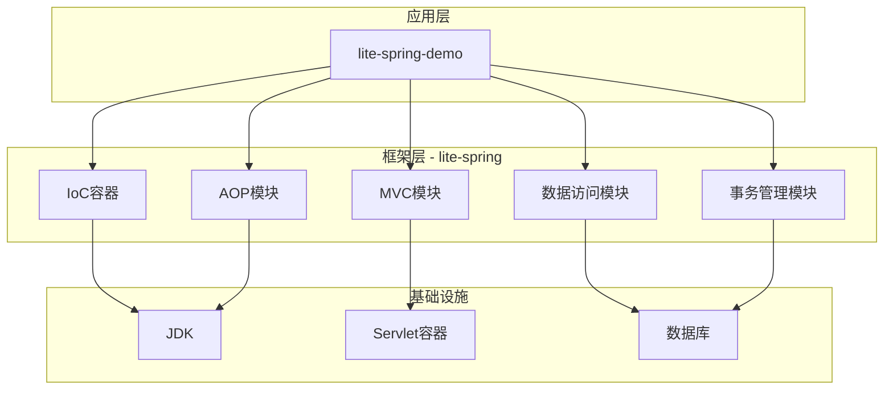
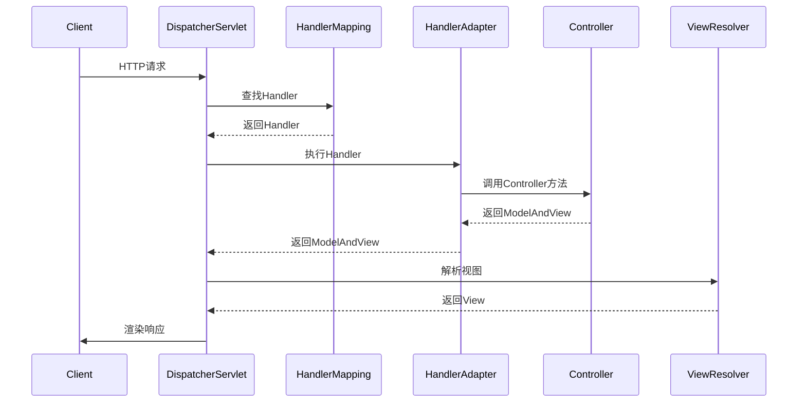
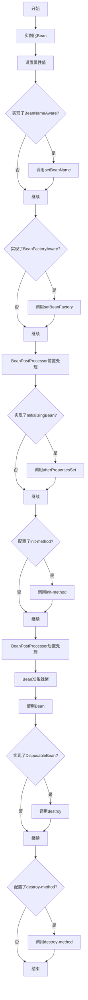

# Lite Spring 架构设计

## 整体架构



---

## 核心模块设计

### 1. IoC容器模块

#### 核心接口
```java
// BeanFactory - Bean工厂顶层接口
public interface BeanFactory {
    Object getBean(String name);
    <T> T getBean(String name, Class<T> requiredType);
    boolean containsBean(String name);
}

// ApplicationContext - 应用上下文（扩展BeanFactory）
public interface ApplicationContext extends BeanFactory {
    String getApplicationName();
    long getStartupDate();
}
```

#### 核心类
- `BeanDefinition`: Bean定义元数据
- `BeanDefinitionRegistry`: Bean定义注册中心
- `DefaultBeanFactory`: 默认Bean工厂实现
- `XmlBeanDefinitionReader`: XML配置读取器
- `AnnotationBeanDefinitionReader`: 注解配置读取器

#### 设计模式
- 工厂模式：BeanFactory
- 单例模式：Bean的单例缓存
- 模板方法：ApplicationContext的初始化流程
- 策略模式：不同的BeanDefinitionReader

---

### 2. AOP模块

#### 核心接口
```java
// 切点
public interface Pointcut {
    boolean matches(Method method, Class<?> targetClass);
}

// 通知
public interface Advice {
}

// 前置通知
public interface MethodBeforeAdvice extends Advice {
    void before(Method method, Object[] args, Object target);
}

// 环绕通知
public interface MethodInterceptor extends Advice {
    Object invoke(MethodInvocation invocation);
}
```

#### 核心类
- `ProxyFactory`: 代理工厂
- `JdkDynamicAopProxy`: JDK动态代理实现
- `CglibAopProxy`: CGLIB代理实现
- `AspectJExpressionPointcut`: AspectJ表达式切点

#### 设计模式
- 代理模式：AOP核心
- 责任链模式：拦截器链
- 策略模式：不同的代理策略

---

### 3. MVC模块

#### 核心组件
```java
// 前端控制器
public class DispatcherServlet extends HttpServlet {
    private HandlerMapping handlerMapping;
    private HandlerAdapter handlerAdapter;
    private ViewResolver viewResolver;
}

// 处理器映射
public interface HandlerMapping {
    HandlerExecutionChain getHandler(HttpServletRequest request);
}

// 处理器适配器
public interface HandlerAdapter {
    ModelAndView handle(HttpServletRequest request, 
                       HttpServletResponse response, 
                       Object handler);
}
```

#### 请求处理流程


#### 设计模式
- 前端控制器模式：DispatcherServlet
- 适配器模式：HandlerAdapter
- 策略模式：ViewResolver

---

### 4. 数据访问模块

#### 核心类
```java
// JDBC模板
public class JdbcTemplate {
    private DataSource dataSource;
    
    public <T> T queryForObject(String sql, RowMapper<T> rowMapper);
    public <T> List<T> query(String sql, RowMapper<T> rowMapper);
    public int update(String sql, Object... args);
}

// 行映射器
public interface RowMapper<T> {
    T mapRow(ResultSet rs, int rowNum) throws SQLException;
}
```

#### 设计模式
- 模板方法：JdbcTemplate
- 回调模式：RowMapper

---

### 5. 事务管理模块

#### 核心接口
```java
// 事务管理器
public interface PlatformTransactionManager {
    TransactionStatus getTransaction(TransactionDefinition definition);
    void commit(TransactionStatus status);
    void rollback(TransactionStatus status);
}

// 事务定义
public interface TransactionDefinition {
    int getPropagationBehavior();
    int getIsolationLevel();
    int getTimeout();
    boolean isReadOnly();
}
```

#### 事务传播机制
- REQUIRED: 如果当前有事务，加入该事务；没有则创建新事务
- REQUIRES_NEW: 总是创建新事务，挂起当前事务
- NESTED: 嵌套事务，依赖于外层事务
- SUPPORTS: 如果有事务则加入，没有则以非事务方式执行
- NOT_SUPPORTED: 以非事务方式执行，挂起当前事务
- MANDATORY: 必须在事务中执行，否则抛异常
- NEVER: 必须在非事务中执行，否则抛异常

#### 设计模式
- 策略模式：不同的事务传播行为
- 模板方法：事务执行流程

---

## Bean的生命周期



---

## 依赖注入的实现

### 三级缓存解决循环依赖

```java
public class DefaultBeanFactory {
    // 一级缓存：完成初始化的单例Bean
    private Map<String, Object> singletonObjects = new ConcurrentHashMap<>();
    
    // 二级缓存：提前暴露的Bean（未完成初始化）
    private Map<String, Object> earlySingletonObjects = new HashMap<>();
    
    // 三级缓存：Bean的工厂对象
    private Map<String, ObjectFactory<?>> singletonFactories = new HashMap<>();
}
```

### 循环依赖解决流程
1. A创建 -> 实例化A -> 将A的ObjectFactory放入三级缓存
2. A注入B -> 发现B不存在，创建B
3. B创建 -> 实例化B -> 将B的ObjectFactory放入三级缓存
4. B注入A -> 从三级缓存获取A的ObjectFactory -> 创建A的早期引用 -> 放入二级缓存
5. B完成初始化 -> 放入一级缓存
6. A注入B成功 -> A完成初始化 -> 放入一级缓存

---

## 扩展点设计

### BeanPostProcessor
在Bean初始化前后进行自定义处理

### BeanFactoryPostProcessor
在BeanFactory标准初始化后进行修改

### ApplicationContextInitializer
在ApplicationContext刷新前进行初始化

---

## 性能优化考虑

1. **Bean创建优化**
   - 单例Bean缓存
   - 懒加载支持
   - 原型Bean池化

2. **反射优化**
   - 方法/字段缓存
   - 使用Method Handles（Java 7+）

3. **类扫描优化**
   - 使用索引而非全包扫描
   - 并行扫描

4. **代理优化**
   - 代理类缓存
   - 智能选择JDK或CGLIB代理

---

## 安全性考虑

1. **类加载安全**
   - 验证类的来源
   - 防止恶意类加载

2. **配置安全**
   - 敏感信息加密
   - 配置文件权限控制

3. **依赖安全**
   - 使用可信的依赖版本
   - 定期更新依赖

---

## 测试策略

1. **单元测试**
   - 每个核心类都有对应测试
   - 使用Mock隔离依赖

2. **集成测试**
   - 测试各模块之间的协作
   - 测试完整的Bean生命周期

3. **性能测试**
   - Bean创建性能
   - 代理性能
   - 并发场景测试


