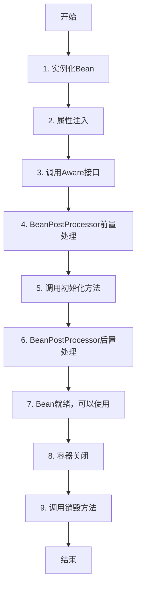

# 第三阶段：Bean生命周期管理实现指南

## 🎯 阶段目标

完善Bean的生命周期管理，让Bean不仅能创建，还能初始化和销毁。支持：
- 初始化方法调用（init-method）
- 销毁方法调用（destroy-method）
- InitializingBean接口
- DisposableBean接口
- BeanPostProcessor扩展点
- Aware接口（BeanNameAware、BeanFactoryAware）

完成后，Bean的生命周期将变为：
```
实例化 → 属性注入 → Aware接口回调 → BeanPostProcessor前置处理 
→ 初始化 → BeanPostProcessor后置处理 → 使用 → 销毁
```

---

## 📚 理论基础

### Bean的完整生命周期



### 为什么需要生命周期回调？

**1. 初始化场景**：
```java
public class DataSource {
    private String url;
    private Connection connection;
    
    // 构造函数时，属性还没注入，url为null
    public DataSource() {
        // 不能在这里建立连接，因为url还没设置
    }
    
    // 初始化方法：属性注入完成后调用
    public void init() {
        // 现在url已经设置好了，可以建立连接
        this.connection = DriverManager.getConnection(url);
    }
}
```

**2. 销毁场景**：
```java
public class ConnectionPool {
    private List<Connection> connections;
    
    public void destroy() {
        // 容器关闭时，释放所有连接
        for (Connection conn : connections) {
            conn.close();
        }
    }
}
```

### 初始化的三种方式

#### 方式1：XML配置init-method

```xml
<bean id="dataSource" class="com.example.DataSource"
      init-method="init"
      destroy-method="destroy"/>
```

```java
public class DataSource {
    public void init() {
        // 初始化逻辑
    }
    
    public void destroy() {
        // 清理逻辑
    }
}
```

**特点**：
- 方法名可以自定义
- 非侵入式（不依赖Spring）
- 需要在XML中配置

#### 方式2：实现InitializingBean接口

```java
public class DataSource implements InitializingBean, DisposableBean {
    
    @Override
    public void afterPropertiesSet() throws Exception {
        // 属性设置后调用
        System.out.println("InitializingBean.afterPropertiesSet()");
    }
    
    @Override
    public void destroy() throws Exception {
        // 销毁时调用
        System.out.println("DisposableBean.destroy()");
    }
}
```

**特点**：
- 不需要XML配置
- 侵入式（依赖Spring接口）
- 方法名固定

#### 方式3：使用注解（第四阶段）

```java
public class DataSource {
    @PostConstruct
    public void init() {
        // 初始化
    }
    
    @PreDestroy
    public void destroy() {
        // 销毁
    }
}
```

### 调用顺序

如果三种方式都配置了，调用顺序是：

**初始化顺序**：
1. `@PostConstruct` 注解方法（第四阶段）
2. `InitializingBean.afterPropertiesSet()`
3. `init-method` 配置的方法

**销毁顺序**：
1. `@PreDestroy` 注解方法（第四阶段）
2. `DisposableBean.destroy()`
3. `destroy-method` 配置的方法

---

## 🔌 BeanPostProcessor扩展点

### 什么是BeanPostProcessor？

BeanPostProcessor是Spring提供的扩展点，允许在Bean初始化前后插入自定义逻辑。

```java
public interface BeanPostProcessor {
    
    /**
     * 在Bean初始化之前调用
     * 可以对Bean进行包装或修改
     */
    default Object postProcessBeforeInitialization(Object bean, String beanName) 
            throws BeansException {
        return bean;
    }
    
    /**
     * 在Bean初始化之后调用
     * 可以对Bean进行包装或修改（如创建代理）
     */
    default Object postProcessAfterInitialization(Object bean, String beanName) 
            throws BeansException {
        return bean;
    }
}
```

### BeanPostProcessor的应用场景

#### 1. 自动装配（@Autowired）

```java
public class AutowiredAnnotationBeanPostProcessor implements BeanPostProcessor {
    @Override
    public Object postProcessBeforeInitialization(Object bean, String beanName) {
        // 扫描@Autowired注解
        // 自动注入依赖
        return bean;
    }
}
```

#### 2. AOP代理创建

```java
public class AopProxyBeanPostProcessor implements BeanPostProcessor {
    @Override
    public Object postProcessAfterInitialization(Object bean, String beanName) {
        // 判断是否需要创建代理
        if (needsProxy(bean)) {
            return createProxy(bean);  // 返回代理对象
        }
        return bean;
    }
}
```

#### 3. 日志、监控等

```java
public class LoggingBeanPostProcessor implements BeanPostProcessor {
    @Override
    public Object postProcessAfterInitialization(Object bean, String beanName) {
        System.out.println("Bean初始化完成: " + beanName);
        return bean;
    }
}
```

### BeanPostProcessor的执行流程

```
创建Bean实例
  ↓
属性注入
  ↓
【BeanPostProcessor.postProcessBeforeInitialization】← 第一个扩展点
  ↓
InitializingBean.afterPropertiesSet()
  ↓
init-method
  ↓
【BeanPostProcessor.postProcessAfterInitialization】← 第二个扩展点（AOP在这里）
  ↓
Bean就绪
```

---

## 👂 Aware接口

### 什么是Aware接口？

Aware接口允许Bean获取容器的相关信息。

```java
// Bean想知道自己的名字
public interface BeanNameAware extends Aware {
    void setBeanName(String name);
}

// Bean想获取BeanFactory
public interface BeanFactoryAware extends Aware {
    void setBeanFactory(BeanFactory beanFactory);
}
```

### 使用场景

```java
public class MyService implements BeanNameAware, BeanFactoryAware {
    
    private String beanName;
    private BeanFactory beanFactory;
    
    @Override
    public void setBeanName(String name) {
        this.beanName = name;
        System.out.println("我的Bean名字是: " + name);
    }
    
    @Override
    public void setBeanFactory(BeanFactory beanFactory) {
        this.beanFactory = beanFactory;
        System.out.println("我可以访问BeanFactory了");
    }
    
    public void doSomething() {
        // 可以动态获取其他Bean
        OtherBean other = beanFactory.getBean("otherBean", OtherBean.class);
    }
}
```

### Aware接口的调用时机

在属性注入之后、初始化之前调用：

```
实例化
  ↓
属性注入
  ↓
【BeanNameAware.setBeanName】← 在这里
【BeanFactoryAware.setBeanFactory】← 在这里
  ↓
BeanPostProcessor前置处理
  ↓
初始化方法
```

---

## 🏗️ 核心组件设计

### 1. InitializingBean接口

```java
public interface InitializingBean {
    /**
     * 在属性设置完成后调用
     * 用于执行初始化逻辑
     */
    void afterPropertiesSet() throws Exception;
}
```

### 2. DisposableBean接口

```java
public interface DisposableBean {
    /**
     * 在Bean销毁时调用
     * 用于释放资源
     */
    void destroy() throws Exception;
}
```

### 3. BeanPostProcessor接口

```java
public interface BeanPostProcessor {
    
    /**
     * 初始化前处理
     */
    default Object postProcessBeforeInitialization(Object bean, String beanName) 
            throws BeansException {
        return bean;
    }
    
    /**
     * 初始化后处理
     */
    default Object postProcessAfterInitialization(Object bean, String beanName) 
            throws BeansException {
        return bean;
    }
}
```

### 4. Aware接口

```java
/**
 * 标记接口
 */
public interface Aware {
}

/**
 * Bean名称感知
 */
public interface BeanNameAware extends Aware {
    void setBeanName(String name);
}

/**
 * BeanFactory感知
 */
public interface BeanFactoryAware extends Aware {
    void setBeanFactory(BeanFactory beanFactory) throws BeansException;
}
```

### 5. DefaultBeanFactory扩展

需要增强的方法：

```java
public class DefaultBeanFactory {
    
    // 存储BeanPostProcessor列表
    private List<BeanPostProcessor> beanPostProcessors = new ArrayList<>();
    
    // 存储需要销毁的Bean
    private Map<String, Object> disposableBeans = new LinkedHashMap<>();
    
    /**
     * 添加BeanPostProcessor
     */
    public void addBeanPostProcessor(BeanPostProcessor beanPostProcessor) {
        this.beanPostProcessors.add(beanPostProcessor);
    }
    
    /**
     * 增强createBean方法，添加生命周期回调
     */
    private Object createBean(String beanName, BeanDefinition bd) {
        // 1. 实例化
        Object bean = instantiateBean(bd);
        
        // 2. 属性注入
        populateBean(beanName, bean, bd);
        
        // 3. 初始化（新增）
        bean = initializeBean(beanName, bean, bd);
        
        // 4. 注册销毁回调（新增）
        registerDisposableBeanIfNecessary(beanName, bean, bd);
        
        return bean;
    }
    
    /**
     * 初始化Bean（新增方法）
     */
    private Object initializeBean(String beanName, Object bean, BeanDefinition bd) {
        // 1. 调用Aware接口
        invokeAwareMethods(beanName, bean);
        
        // 2. BeanPostProcessor前置处理
        Object wrappedBean = applyBeanPostProcessorsBeforeInitialization(bean, beanName);
        
        // 3. 调用初始化方法
        invokeInitMethods(beanName, wrappedBean, bd);
        
        // 4. BeanPostProcessor后置处理
        wrappedBean = applyBeanPostProcessorsAfterInitialization(wrappedBean, beanName);
        
        return wrappedBean;
    }
    
    /**
     * 调用Aware接口
     */
    private void invokeAwareMethods(String beanName, Object bean) {
        if (bean instanceof BeanNameAware) {
            ((BeanNameAware) bean).setBeanName(beanName);
        }
        if (bean instanceof BeanFactoryAware) {
            ((BeanFactoryAware) bean).setBeanFactory(this);
        }
    }
    
    /**
     * 调用初始化方法
     */
    private void invokeInitMethods(String beanName, Object bean, BeanDefinition bd) {
        // 1. 先调用InitializingBean接口
        if (bean instanceof InitializingBean) {
            ((InitializingBean) bean).afterPropertiesSet();
        }
        
        // 2. 再调用自定义init-method
        String initMethodName = bd.getInitMethodName();
        if (initMethodName != null && !initMethodName.isEmpty()) {
            Method initMethod = bean.getClass().getMethod(initMethodName);
            initMethod.invoke(bean);
        }
    }
    
    /**
     * 容器关闭时调用（新增方法）
     */
    public void close() {
        // 遍历所有需要销毁的Bean
        for (Map.Entry<String, Object> entry : disposableBeans.entrySet()) {
            destroyBean(entry.getKey(), entry.getValue());
        }
    }
    
    /**
     * 销毁单个Bean
     */
    private void destroyBean(String beanName, Object bean) {
        // 1. 先调用DisposableBean接口
        if (bean instanceof DisposableBean) {
            ((DisposableBean) bean).destroy();
        }
        
        // 2. 再调用自定义destroy-method
        BeanDefinition bd = getBeanDefinition(beanName);
        String destroyMethodName = bd.getDestroyMethodName();
        if (destroyMethodName != null && !destroyMethodName.isEmpty()) {
            Method destroyMethod = bean.getClass().getMethod(destroyMethodName);
            destroyMethod.invoke(bean);
        }
    }
}
```

---

## 📋 实现步骤

### 步骤1：创建接口定义

**任务**：创建生命周期相关的接口

**需要创建的接口**：
1. `InitializingBean` - 初始化Bean接口
2. `DisposableBean` - 销毁Bean接口
3. `BeanPostProcessor` - Bean后置处理器接口
4. `Aware` - 标记接口
5. `BeanNameAware` - Bean名称感知接口
6. `BeanFactoryAware` - BeanFactory感知接口

**测试思路**：
```java
@Test
public void testInitializingBean() {
    // 创建实现了InitializingBean的Bean
    // 验证afterPropertiesSet被调用
}
```

---

### 步骤2：增强DefaultBeanFactory

**任务**：添加生命周期管理功能

**需要添加的字段**：
```java
// 存储BeanPostProcessor
private List<BeanPostProcessor> beanPostProcessors = new ArrayList<>();

// 存储可销毁的Bean（单例且有销毁逻辑的）
private Map<String, Object> disposableBeans = new LinkedHashMap<>();
```

**需要添加的方法**：
- `addBeanPostProcessor()` - 添加BeanPostProcessor
- `initializeBean()` - 初始化Bean
- `invokeAwareMethods()` - 调用Aware接口
- `applyBeanPostProcessorsBeforeInitialization()` - 前置处理
- `applyBeanPostProcessorsAfterInitialization()` - 后置处理
- `invokeInitMethods()` - 调用初始化方法
- `registerDisposableBeanIfNecessary()` - 注册销毁回调
- `close()` - 关闭容器
- `destroyBean()` - 销毁Bean

**关键点**：
- 在createBean中调用initializeBean
- 确保调用顺序正确
- 处理异常

---

### 步骤3：实现initializeBean方法

**调用流程**：
```
1. invokeAwareMethods
   - BeanNameAware.setBeanName
   - BeanFactoryAware.setBeanFactory

2. applyBeanPostProcessorsBeforeInitialization
   - 遍历所有BeanPostProcessor
   - 调用postProcessBeforeInitialization

3. invokeInitMethods
   - InitializingBean.afterPropertiesSet
   - 自定义init-method

4. applyBeanPostProcessorsAfterInitialization
   - 遍历所有BeanPostProcessor
   - 调用postProcessAfterInitialization
```

**实现提示**：
```java
private Object initializeBean(String beanName, Object bean, BeanDefinition bd) {
    // 1. Aware接口回调
    invokeAwareMethods(beanName, bean);
    
    // 2. BeanPostProcessor前置处理
    Object wrappedBean = bean;
    for (BeanPostProcessor processor : beanPostProcessors) {
        Object current = processor.postProcessBeforeInitialization(wrappedBean, beanName);
        if (current == null) {
            return wrappedBean;  // 返回原Bean
        }
        wrappedBean = current;
    }
    
    // 3. 初始化方法
    try {
        invokeInitMethods(beanName, wrappedBean, bd);
    } catch (Exception e) {
        throw new BeansException("初始化方法调用失败: " + beanName, e);
    }
    
    // 4. BeanPostProcessor后置处理
    for (BeanPostProcessor processor : beanPostProcessors) {
        Object current = processor.postProcessAfterInitialization(wrappedBean, beanName);
        if (current == null) {
            return wrappedBean;
        }
        wrappedBean = current;
    }
    
    return wrappedBean;
}
```

---

### 步骤4：实现invokeInitMethods方法

**调用顺序**：
1. 先调用 `InitializingBean.afterPropertiesSet()`
2. 再调用自定义 `init-method`

**实现提示**：
```java
private void invokeInitMethods(String beanName, Object bean, BeanDefinition bd) 
        throws Exception {
    
    // 1. InitializingBean接口
    if (bean instanceof InitializingBean) {
        ((InitializingBean) bean).afterPropertiesSet();
    }
    
    // 2. 自定义init-method
    String initMethodName = bd.getInitMethodName();
    if (initMethodName != null && !initMethodName.isEmpty()) {
        // 避免重复调用（如果方法名是afterPropertiesSet）
        if (bean instanceof InitializingBean && "afterPropertiesSet".equals(initMethodName)) {
            return;
        }
        
        Method initMethod = bean.getClass().getMethod(initMethodName);
        initMethod.invoke(bean);
    }
}
```

**注意事项**：
- 方法必须是无参的
- 方法可以抛出异常
- 如果InitializingBean接口的方法名和init-method相同，只调用一次

---

### 步骤5：实现销毁方法

**任务**：实现Bean的销毁逻辑

**需要实现**：
1. `registerDisposableBeanIfNecessary()` - 注册需要销毁的Bean
2. `close()` - 关闭容器
3. `destroyBean()` - 销毁单个Bean

**实现提示**：

```java
/**
 * 注册可销毁的Bean
 */
private void registerDisposableBeanIfNecessary(String beanName, Object bean, BeanDefinition bd) {
    // 只有单例Bean才需要注册销毁
    if (!bd.isSingleton()) {
        return;
    }
    
    // 判断是否需要销毁回调
    boolean needsDestroy = (bean instanceof DisposableBean) ||
                          (bd.getDestroyMethodName() != null && !bd.getDestroyMethodName().isEmpty());
    
    if (needsDestroy) {
        disposableBeans.put(beanName, bean);
    }
}

/**
 * 关闭容器
 */
public void close() {
    // 销毁所有单例Bean
    for (String beanName : new ArrayList<>(disposableBeans.keySet())) {
        try {
            destroyBean(beanName, disposableBeans.get(beanName));
        } catch (Exception e) {
            // 销毁失败不应该影响其他Bean的销毁
            System.err.println("销毁Bean失败: " + beanName + ", " + e.getMessage());
        }
    }
    disposableBeans.clear();
}

/**
 * 销毁Bean
 */
private void destroyBean(String beanName, Object bean) throws Exception {
    // 1. DisposableBean接口
    if (bean instanceof DisposableBean) {
        ((DisposableBean) bean).destroy();
    }
    
    // 2. 自定义destroy-method
    BeanDefinition bd = getBeanDefinition(beanName);
    String destroyMethodName = bd.getDestroyMethodName();
    if (destroyMethodName != null && !destroyMethodName.isEmpty()) {
        // 避免重复调用
        if (bean instanceof DisposableBean && "destroy".equals(destroyMethodName)) {
            return;
        }
        
        Method destroyMethod = bean.getClass().getMethod(destroyMethodName);
        destroyMethod.invoke(bean);
    }
}
```

---

### 步骤6：支持BeanPostProcessor自动注册

**问题**：BeanPostProcessor本身也是Bean，如何自动注册？

**解决方案**：在Bean创建后检查类型

```java
private Object createBean(String beanName, BeanDefinition bd) {
    // ... 现有逻辑 ...
    
    // 如果Bean是BeanPostProcessor，自动注册
    if (bean instanceof BeanPostProcessor) {
        addBeanPostProcessor((BeanPostProcessor) bean);
    }
    
    return bean;
}
```

**注意**：BeanPostProcessor的注册时机很重要
- 应该在其他Bean创建之前注册
- 可以考虑预先初始化BeanPostProcessor类型的Bean

---

## 🎯 完整的Bean生命周期流程

```java
// 伪代码展示完整流程
Object createBean(String beanName, BeanDefinition bd) {
    // 【1】实例化
    Object bean = instantiateBean(bd);
    
    // 【2】属性注入
    populateBean(beanName, bean, bd);
    
    // 【3】Aware接口回调
    if (bean instanceof BeanNameAware) {
        ((BeanNameAware) bean).setBeanName(beanName);
    }
    if (bean instanceof BeanFactoryAware) {
        ((BeanFactoryAware) bean).setBeanFactory(this);
    }
    
    // 【4】BeanPostProcessor前置处理
    for (BeanPostProcessor processor : beanPostProcessors) {
        bean = processor.postProcessBeforeInitialization(bean, beanName);
    }
    
    // 【5】InitializingBean接口
    if (bean instanceof InitializingBean) {
        ((InitializingBean) bean).afterPropertiesSet();
    }
    
    // 【6】自定义init-method
    if (bd.getInitMethodName() != null) {
        invokeCustomInitMethod(bean, bd.getInitMethodName());
    }
    
    // 【7】BeanPostProcessor后置处理（AOP代理在这里创建）
    for (BeanPostProcessor processor : beanPostProcessors) {
        bean = processor.postProcessAfterInitialization(bean, beanName);
    }
    
    // 【8】注册销毁回调
    if (bd.isSingleton()) {
        registerDisposableBean(beanName, bean, bd);
    }
    
    return bean;
}

// 容器关闭时
void close() {
    // 【9】DisposableBean接口
    if (bean instanceof DisposableBean) {
        ((DisposableBean) bean).destroy();
    }
    
    // 【10】自定义destroy-method
    if (bd.getDestroyMethodName() != null) {
        invokeCustomDestroyMethod(bean, bd.getDestroyMethodName());
    }
}
```

---

## 🧪 测试用例设计

### 测试1：InitializingBean接口

```java
public class TestBean implements InitializingBean {
    private boolean initialized = false;
    
    @Override
    public void afterPropertiesSet() {
        this.initialized = true;
    }
    
    public boolean isInitialized() {
        return initialized;
    }
}

@Test
public void testInitializingBean() {
    TestBean bean = factory.getBean("testBean", TestBean.class);
    assertTrue(bean.isInitialized());
}
```

### 测试2：init-method

```xml
<bean id="testBean" class="..." init-method="myInit"/>
```

```java
public class TestBean {
    private boolean initialized = false;
    
    public void myInit() {
        this.initialized = true;
    }
}
```

### 测试3：销毁方法

```java
public class TestBean implements DisposableBean {
    private boolean destroyed = false;
    
    @Override
    public void destroy() {
        this.destroyed = true;
    }
    
    public boolean isDestroyed() {
        return destroyed;
    }
}

@Test
public void testDisposableBean() {
    TestBean bean = factory.getBean("testBean", TestBean.class);
    assertFalse(bean.isDestroyed());
    
    factory.close();  // 关闭容器
    assertTrue(bean.isDestroyed());
}
```

### 测试4：BeanPostProcessor

```java
public class LoggingBeanPostProcessor implements BeanPostProcessor {
    private List<String> processedBeans = new ArrayList<>();
    
    @Override
    public Object postProcessAfterInitialization(Object bean, String beanName) {
        processedBeans.add(beanName);
        return bean;
    }
    
    public List<String> getProcessedBeans() {
        return processedBeans;
    }
}

@Test
public void testBeanPostProcessor() {
    LoggingBeanPostProcessor processor = new LoggingBeanPostProcessor();
    factory.addBeanPostProcessor(processor);
    
    factory.getBean("testBean");
    
    assertTrue(processor.getProcessedBeans().contains("testBean"));
}
```

### 测试5：完整生命周期

```java
public class FullLifecycleBean implements 
        BeanNameAware, 
        BeanFactoryAware,
        InitializingBean, 
        DisposableBean {
    
    private List<String> callbacks = new ArrayList<>();
    private String beanName;
    private BeanFactory beanFactory;
    
    @Override
    public void setBeanName(String name) {
        callbacks.add("setBeanName");
        this.beanName = name;
    }
    
    @Override
    public void setBeanFactory(BeanFactory beanFactory) {
        callbacks.add("setBeanFactory");
        this.beanFactory = beanFactory;
    }
    
    @Override
    public void afterPropertiesSet() {
        callbacks.add("afterPropertiesSet");
    }
    
    public void customInit() {
        callbacks.add("customInit");
    }
    
    @Override
    public void destroy() {
        callbacks.add("destroy");
    }
    
    public void customDestroy() {
        callbacks.add("customDestroy");
    }
    
    public List<String> getCallbacks() {
        return callbacks;
    }
}

@Test
public void testFullLifecycle() {
    FullLifecycleBean bean = factory.getBean("bean", FullLifecycleBean.class);
    
    // 验证初始化顺序
    List<String> callbacks = bean.getCallbacks();
    assertEquals("setBeanName", callbacks.get(0));
    assertEquals("setBeanFactory", callbacks.get(1));
    assertEquals("afterPropertiesSet", callbacks.get(2));
    assertEquals("customInit", callbacks.get(3));
    
    factory.close();
    
    // 验证销毁顺序
    assertEquals("destroy", callbacks.get(4));
    assertEquals("customDestroy", callbacks.get(5));
}
```

---

## 🤔 思考题

实现前思考这些问题：

1. **为什么需要InitializingBean接口和init-method两种方式？**
   - 各有什么优缺点？

2. **BeanPostProcessor的两个方法返回值是什么含义？**
   - 如果返回null会怎样？
   - 为什么可以返回不同的对象？

3. **为什么AOP代理要在postProcessAfterInitialization中创建？**
   - 为什么不能在前置处理中创建？

4. **原型Bean需要销毁回调吗？**
   - 如果需要，谁来调用？

5. **如果init-method调用失败，Bean还能用吗？**
   - 应该抛出异常还是忽略？

6. **BeanPostProcessor自己的生命周期是怎样的？**
   - 谁来处理BeanPostProcessor的初始化？

---

## 📊 与第二阶段的对比

| 方面 | 第二阶段 | 第三阶段 |
|------|---------|---------|
| **Bean创建** | ✅ 实例化+属性注入 | ✅ +生命周期回调 |
| **初始化** | ❌ 不支持 | ✅ 接口+配置两种方式 |
| **销毁** | ❌ 不支持 | ✅ 容器关闭时调用 |
| **扩展点** | ❌ 没有 | ✅ BeanPostProcessor |
| **Aware** | ❌ 不支持 | ✅ 2个Aware接口 |
| **生命周期** | 简单 | 完整 |

---

## ✅ 完成标志

完成第三阶段后，你应该能够：

1. ✅ Bean初始化时调用InitializingBean接口
2. ✅ Bean初始化时调用自定义init-method
3. ✅ Bean销毁时调用DisposableBean接口
4. ✅ Bean销毁时调用自定义destroy-method
5. ✅ 支持BeanPostProcessor扩展点
6. ✅ 支持BeanNameAware接口
7. ✅ 支持BeanFactoryAware接口
8. ✅ 正确的生命周期调用顺序
9. ✅ 容器关闭时自动销毁Bean

---

## 🎓 学习建议

### 实现顺序建议

1. **先实现接口定义**（简单）
2. **再实现Aware接口回调**（中等）
3. **然后实现初始化方法**（中等）
4. **接着实现销毁方法**（中等）
5. **最后实现BeanPostProcessor**（稍难）

### 调试技巧

1. **添加日志**
```java
System.out.println("【1】实例化: " + beanName);
System.out.println("【2】属性注入: " + beanName);
System.out.println("【3】Aware回调: " + beanName);
// ...
```

2. **使用断点**
在initializeBean方法的每个步骤打断点

3. **观察调用栈**
看方法的调用顺序是否正确

---

## 🚀 准备好了吗？

理解这份文档后，告诉我，我会为你提供：
- 完整的接口定义
- 增强的DefaultBeanFactory实现
- 完整的测试用例
- 测试用的Bean类

第三阶段会让你的框架更加完善，Bean真正"活起来"！

有任何疑问随时问我！💪

