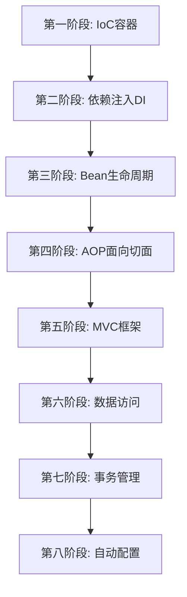

# Lite Spring 学习路线图

## 项目目标
通过从零实现一个类似Spring的框架，深入理解Spring、Spring Boot、Spring MVC的核心原理和设计思想。

## 整体架构规划



---

## 第一阶段：IoC容器基础 (控制反转)

### 学习目标
- 理解什么是IoC（控制反转）
- 实现简单的Bean容器
- 支持基于XML的Bean定义

### 核心功能
1. **BeanDefinition**：Bean的元数据定义
   - Bean的类名
   - Bean的作用域（singleton/prototype）
   - Bean的属性

2. **BeanFactory**：Bean工厂接口
   - `getBean(String name)` 方法
   - 简单的单例Bean缓存

3. **XML配置解析**
   - 解析XML配置文件
   - 构建BeanDefinition

### 实现任务
- [ ] 定义 `BeanDefinition` 类
- [ ] 实现 `BeanFactory` 接口
- [ ] 实现 `SimpleBeanFactory` 基础实现
- [ ] 实现简单的XML解析器
- [ ] 编写测试用例

### 参考资料
- Spring IoC容器的设计理念
- 工厂模式、单例模式

---

## 第二阶段：依赖注入 (DI)

### 学习目标
- 理解依赖注入的原理
- 实现构造器注入
- 实现setter注入
- 处理Bean之间的依赖关系

### 核心功能
1. **属性注入**
   - 基本类型注入
   - Bean引用注入
   - 集合类型注入

2. **构造器注入**
   - 解析构造器参数
   - 根据类型匹配构造器

3. **循环依赖处理**
   - 三级缓存机制
   - 提前暴露Bean引用

### 实现任务
- [ ] 支持setter方法注入
- [ ] 支持构造器注入
- [ ] 实现循环依赖检测
- [ ] 实现三级缓存解决循环依赖
- [ ] 编写复杂场景测试

### 参考资料
- Spring循环依赖解决方案
- 反射机制的应用

---

## 第三阶段：Bean生命周期管理

### 学习目标
- 理解Bean的完整生命周期
- 实现Bean的初始化和销毁回调
- 支持BeanPostProcessor扩展点

### 核心功能
1. **Bean生命周期**
   ```
   实例化 -> 属性注入 -> 初始化前处理 -> 初始化 -> 初始化后处理 -> 使用 -> 销毁
   ```

2. **初始化和销毁**
   - `init-method` 配置支持
   - `destroy-method` 配置支持
   - `InitializingBean` 接口
   - `DisposableBean` 接口

3. **BeanPostProcessor**
   - `postProcessBeforeInitialization` 方法
   - `postProcessAfterInitialization` 方法

### 实现任务
- [ ] 定义Bean生命周期接口
- [ ] 实现初始化方法调用
- [ ] 实现销毁方法调用
- [ ] 实现BeanPostProcessor机制
- [ ] 支持@PostConstruct和@PreDestroy注解

### 参考资料
- Spring Bean生命周期详解
- 模板方法模式

---

## 第四阶段：注解驱动开发

### 学习目标
- 摆脱XML配置，使用注解
- 实现组件扫描
- 支持常用注解

### 核心功能
1. **组件扫描**
   - `@Component` 及其衍生注解
   - `@ComponentScan` 包扫描
   - 类路径扫描工具

2. **依赖注入注解**
   - `@Autowired` 自动装配
   - `@Qualifier` 限定符
   - `@Value` 值注入

3. **配置类**
   - `@Configuration` 配置类
   - `@Bean` 方法定义Bean

### 实现任务
- [ ] 实现类路径扫描器
- [ ] 支持@Component等注解
- [ ] 实现@Autowired注入
- [ ] 支持@Configuration和@Bean
- [ ] 实现AnnotationConfigApplicationContext

### 参考资料
- Java反射和注解
- Spring注解驱动原理

---

## 第五阶段：AOP面向切面编程

### 学习目标
- 理解AOP的核心概念
- 实现动态代理
- 支持常用切面场景

### 核心功能
1. **AOP核心概念**
   - 切点(Pointcut)
   - 通知(Advice): Before, After, Around
   - 切面(Aspect)
   - 连接点(JoinPoint)

2. **代理机制**
   - JDK动态代理
   - CGLIB代理

3. **切面织入**
   - 在Bean初始化后进行代理
   - 切点表达式匹配

### 实现任务
- [ ] 定义AOP核心接口
- [ ] 实现JDK动态代理
- [ ] 实现CGLIB代理
- [ ] 支持切点表达式
- [ ] 实现@Aspect注解支持
- [ ] 编写事务、日志等示例切面

### 参考资料
- Spring AOP原理
- 代理模式
- AspectJ表达式

---

## 第六阶段：MVC框架

### 学习目标
- 理解Spring MVC的工作流程
- 实现DispatcherServlet
- 支持RESTful API

### 核心功能
1. **核心组件**
   - DispatcherServlet：前端控制器
   - HandlerMapping：处理器映射
   - HandlerAdapter：处理器适配器
   - ViewResolver：视图解析器

2. **请求处理流程**
   ```
   请求 -> DispatcherServlet -> HandlerMapping -> Controller -> ViewResolver -> 响应
   ```

3. **注解支持**
   - `@Controller` / `@RestController`
   - `@RequestMapping` 及其变体
   - `@RequestParam`、`@PathVariable`
   - `@RequestBody`、`@ResponseBody`

### 实现任务
- [ ] 实现DispatcherServlet
- [ ] 实现HandlerMapping
- [ ] 支持@Controller和@RequestMapping
- [ ] 实现参数绑定
- [ ] 实现JSON序列化支持
- [ ] 添加拦截器机制

### 参考资料
- Spring MVC工作原理
- Servlet规范
- 前端控制器模式

---

## 第七阶段：数据访问层

### 学习目标
- 简化JDBC操作
- 实现JdbcTemplate
- 支持ORM映射

### 核心功能
1. **JdbcTemplate**
   - 数据库连接管理
   - SQL执行和结果映射
   - 异常转换

2. **数据源管理**
   - DataSource配置
   - 连接池集成

3. **简单的ORM支持**
   - 实体类映射
   - CRUD操作封装

### 实现任务
- [ ] 实现JdbcTemplate
- [ ] 实现RowMapper接口
- [ ] 支持命名参数
- [ ] 集成数据库连接池
- [ ] 实现简单的Repository支持

### 参考资料
- Spring JDBC
- 模板方法模式

---

## 第八阶段：事务管理

### 学习目标
- 理解Spring事务管理原理
- 实现声明式事务
- 支持事务传播

### 核心功能
1. **事务抽象**
   - PlatformTransactionManager
   - TransactionDefinition
   - TransactionStatus

2. **声明式事务**
   - `@Transactional` 注解
   - 基于AOP的事务拦截

3. **事务传播**
   - REQUIRED
   - REQUIRES_NEW
   - NESTED
   - 等多种传播行为

### 实现任务
- [ ] 定义事务管理器接口
- [ ] 实现DataSourceTransactionManager
- [ ] 支持@Transactional注解
- [ ] 实现事务拦截器
- [ ] 支持事务传播机制

### 参考资料
- Spring事务管理
- 数据库事务隔离级别

---

## 第九阶段：自动配置（类似Spring Boot）

### 学习目标
- 理解Spring Boot自动配置原理
- 实现约定优于配置
- 简化应用启动

### 核心功能
1. **自动配置**
   - `@EnableAutoConfiguration`
   - 条件注解：`@ConditionalOnClass`等
   - 自动配置类加载

2. **Starter机制**
   - 依赖管理
   - 自动配置导入

3. **内嵌服务器**
   - 集成Tomcat
   - 一键启动Web应用

### 实现任务
- [ ] 实现自动配置加载机制
- [ ] 支持条件注解
- [ ] 实现启动类@LiteSpringBootApplication
- [ ] 集成内嵌Tomcat
- [ ] 创建starter模板

### 参考资料
- Spring Boot自动配置原理
- SPI机制

---

## 第十阶段：完善和优化

### 功能完善
- [ ] 添加更完整的异常处理
- [ ] 性能优化
- [ ] 日志系统集成
- [ ] 配置文件支持（properties、yml）
- [ ] 单元测试覆盖
- [ ] 编写完整文档

### 高级特性
- [ ] 缓存抽象
- [ ] 定时任务支持
- [ ] 事件机制
- [ ] 国际化支持
- [ ] Validation验证框架

---

## 开发建议

### 学习方法
1. **每个阶段独立完成**：不要一次做太多，扎实掌握每个知识点
2. **编写测试用例**：通过测试驱动开发，确保功能正确
3. **对比Spring源码**：实现后对比Spring的实现，学习优秀设计
4. **写技术博客**：记录学习过程和心得体会
5. **持续重构**：随着理解深入，不断优化代码结构

### 调试技巧
- 使用断点调试，理解代码执行流程
- 打印Bean的创建和初始化过程
- 查看生成的代理类
- 分析异常堆栈，定位问题

### 参考资源
- Spring Framework官方文档
- 《Spring源码深度解析》
- 《Spring揭秘》
- GitHub上的优秀Spring学习项目

---

## 预计时间

| 阶段 | 预计时间 | 难度 |
|-----|---------|------|
| 第一阶段：IoC容器 | 1-2周 | ⭐⭐ |
| 第二阶段：依赖注入 | 1-2周 | ⭐⭐⭐ |
| 第三阶段：Bean生命周期 | 1周 | ⭐⭐ |
| 第四阶段：注解驱动 | 1-2周 | ⭐⭐⭐ |
| 第五阶段：AOP | 2-3周 | ⭐⭐⭐⭐ |
| 第六阶段：MVC框架 | 2-3周 | ⭐⭐⭐⭐ |
| 第七阶段：数据访问 | 1-2周 | ⭐⭐⭐ |
| 第八阶段：事务管理 | 1-2周 | ⭐⭐⭐⭐ |
| 第九阶段：自动配置 | 2周 | ⭐⭐⭐ |
| 第十阶段：完善优化 | 持续 | ⭐⭐⭐ |

**总计：约3-6个月**（根据个人时间和基础而定）

---

## 当前进度

- [x] 项目初始化
- [ ] 第一阶段开发中...


